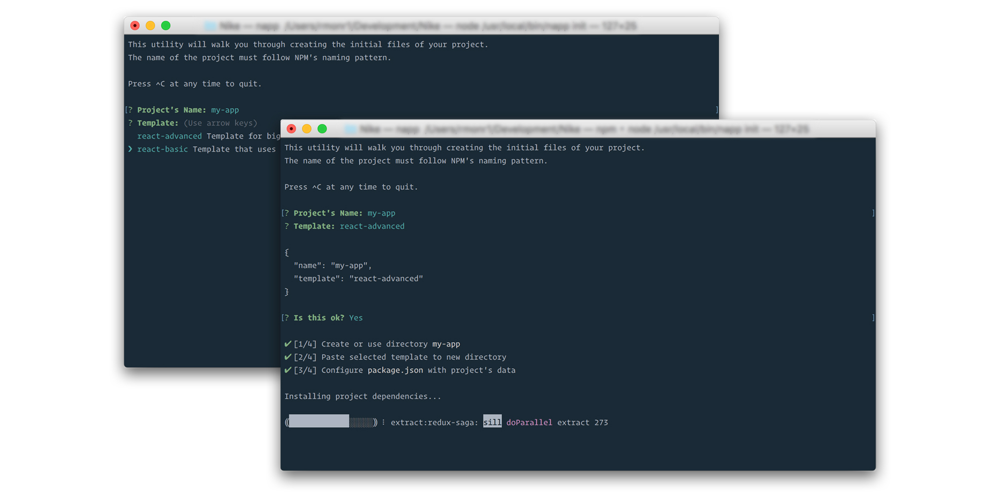

# { napp }
###### An opinionated CLI for scaffolding projects based on templates.

[](https://bitbucket.nike.com/users/rmonr1/repos/napp/browse/LICENSE)
[](https://nikecdt.slack.com/messages/napp)


## Overview
Napp it’s a cli tool that initializes/run projects that follow a strict but basic structure (template). The goal of napp is to start and build projects faster, so it comes with pre-installed configurations for Webpack, Eslint and Babel.

It’s highly inspired by Facebook’s [create-react-app](https://github.com/facebookincubator/create-react-app) (even uses scripts from it) and Vue CLI.

Differences with create-react-app:

* Napp uses templates, meaning you can build your own template from a code you wrote and save it for later use.
* It is not coupled with [React](https://facebook.github.io/react/), you can use whatever you want as long as the template follows a valid/simple structure.
* You don’t need to **eject** to increase features on Webpack because you have the ability to **extend**, **overwrite** or **use your own** configurations.
* It uses Webpack 2, which takes advantages of tree shaking and other awesome features.
* Stimulates ES6 code by adding [babel-polyfill](https://babeljs.io/docs/usage/polyfill/) by default, requiring it as the unique polyfill needed.
* It uses Stylus as CSS pre processor but you can use whatever you want. You just need to extend the configurations a little.
> Yarn is not supported yet but it will be soon.
-----------------------

## Getting Started
You need to have node >= 4 in your machine, but a version 6 is strongly recommended for efficiency.

Install napp only once (globally):
```
npm install -g @nike/napp
```
> You don't need to install neither Webpack, Babel or Eslint since those come with napp already.
-----------------------

## Usage
Napp has **react-basic** and **react-advanced** as pre-installed templates to start with. Just run the command below to initialize the process of creating a new project and use any template installed:
```
napp init
```
It will ask for basic information to create a new project. The next thing to do is to move to the new folder created (`cd you-project`) and run it with `napp run` or `npm start`.
This executes a **webpack-dev-server** with a default **dev** configuration but you can change it by adding the option *env* `--env prod` (prod is not recommended since can take a lot of time on compilings) or a configuration you created (more about this later).

Here's a table of the available commands on napp:

| Commands                           | Alias     | Description                                             |
| ---------------------------------- | --------- | ------------------------------------------------------- |
| `init`                             |           | Initialize a new project inside current directory       |
| `run [options]`                    |           | Run the project within a dev server                     |
| `build`                            |           | Build bundles of scripts and styles in production mode  |
| `list`                             | `ls`      | List all templates installed                            |
| `make [template]`                  | `mk`      | Make a template from current folder                     |
| `remove [template] [templates...]` | `rm`      | Remove templates from file system                       |
> You can always use `napp --help` or `napp run --help` for more info on each command.
-----------------------

## Creating Templates
To create a template your project tree needs to have the next structure:
```
your-app/
  public/
    index.html
  src/
    index.js
  package.json
```
By having this we're telling napp where to find the index files to compile. This is done by webpack with napp's configurations. The `index.html` is used as a html template and all the bundles will be inserted into it automatically.

The description of the template will be the description that your project has in its **package.json**. The name, on the other hand, will be whatever you decide from the cli.

Suppose you have a project ready to be saved as template, you need to execute the command `napp make` inside the root of your project. To make our life easier we have 2 ways to make a template:
* `napp make` or `napp mk` - This will ask you if you want to use the name of the project as the name of the template. If you say no then it will ask you for a template's name, if you say yes it will use the name of your project.
* `napp make your-template` or `napp mk your-template` - This is a shortcut to avoid the prompt question and use a name directly.

That's all, you can execute `napp list` or `napp ls` to see all templates installed. Your new template should be listed there.

> It might be really helpful to look at each template so you can have an idea of how templates are organized.
-----------------------

## Removing Templates
You have 2 ways to remove templates too:
* `napp remove` or `napp rm` - This will show you a prompt which lists all the templates installed. You can select multiple templates with the space bar and then hit enter.
* `napp remove your-template` or `napp rm your-template` - You can delete templates directly if you know the name of the templates. You can also delete more than one, i.e. `napp remove my-first my-second`.
> It's safer to use the first option since it warns and confirm you about removing the selected templates.
-----------------------

## Configurations
Most of the time you won't need to change webpack's behavior. But you can extend, overwrite or create your own configurations if you need to install different plugins or add more loaders or whatever else.

Napp uses 2 main configuration files: **webpack.config.dev.js** and **webpack.config.prod.js**. You tell napp to use a config by passing the option **dev** on `napp run` command.

For example, `napp run --env dev` expects that a configuration file with the name webpack.config.**dev**.js exists and it will use it. So you can have your own configurations in your projects, if you have a **webpack.config.staging.js** you have to exec `napp run --env staging` to use that config.

That means that config names are pretty much important. In this way you have the possiblility to extend too. For instance, if you have a config file named **webpack.extend.dev.js**, it will be smartly merged with napp default's **webpack.config.dev.js**.

So, you can have an extend file that could only look like the code below, keeping your config pretty simple:
```javascript
// webpack.extend.prod.js
var SWPrecachePlugin = require('sw-precache-webpack-plugin');
var pkg = require('./package.json');
module.exports = {
  plugins: [
    new SWPrecachePlugin({
      cacheId: pkg.name,
    })
  ]
};
```

Lastly, if you have a **webpack.config.dev.js** in your project, it will overwrite the **webpack.config.dev.js** of napp.
> Please note that all of these configurations files need to be in the root of the project so napp can find/use them.
-----------------------

## Contribute
Feel free to dive in and submit some [PRs](https://bitbucket.nike.com/users/rmonr1/repos/napp/pull-requests).

-----------------------

## License
[MIT](https://bitbucket.nike.com/users/rmonr1/repos/napp/browse/LICENSE) @ René Monroy
